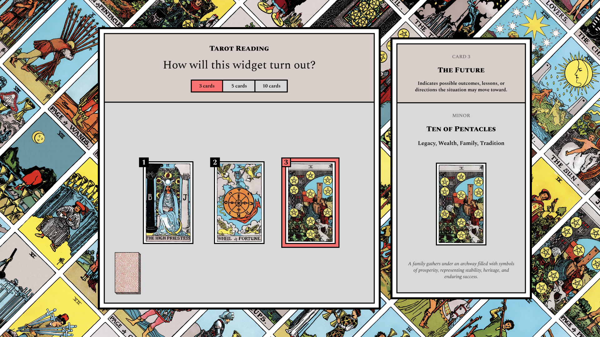

# Tarot Reading Figma Widget

**tarot-reading** is a Figma widget that brings the mystical art of tarot directly into your Figma workspace. Using the classic **Rider–Waite Tarot deck**, it allows you to perform virtual tarot readings with ease and clarity.

 

## Features

- **Question Input** – Enter a question to focus your reading.  
- **Complete Deck** – Includes all **78 tarot cards** with:  
  - Meanings  
  - Descriptions  
  - Symbolism  
- **Three Reading Types/Spreads**:  
  1. **3-Card Spread** – Past, Present, Future.  
  2. **5-Card Spread** – A cross layout revealing deeper insights.  
  3. **10-Card Celtic Cross** – The classic detailed spread for a comprehensive reading.  
- **Card Insights** – Each card drawn in a spread comes with a full description to help interpret your reading.  

## How to Use

1. Install the **tarot-reading** widget in Figma.  
2. Click the widget to open it.  
3. Type a question you’d like guidance on.  
4. Select a reading type (3-card, 5-card, or 10-card).  
5. Draw your cards.  
6. View each card’s meanings, descriptions, and symbology in the spread.

## Installation

1. Open Figma and navigate to the **Widgets** panel.  
2. Search for **tarot-reading**.  
3. Click **Install**.

## Contributing

Contributions are welcome! Feel free to submit issues, bug reports, or feature requests. Pull requests should follow consistent formatting and maintain readability.  

## Development  

Clone this repo and run locally:  

```bash
git clone https://github.com/erikdotdesign/tarot-reading.git
cd tarot-reading
npm install
npm run dev
Load the manifest.json into Figma → Widgets → Development → Import widget from manifest…
```

This plugin is built with:  
- [Three.js](https://threejs.org/) for 3D rendering  
- [React-three-fiber](https://r3f.docs.pmnd.rs/getting-started/introduction) for 3D rendering
- [Figma Widgets API](https://developers.figma.com/docs/widgets/)  
- React + TypeScript 

## License

This project is licensed under the MIT License.